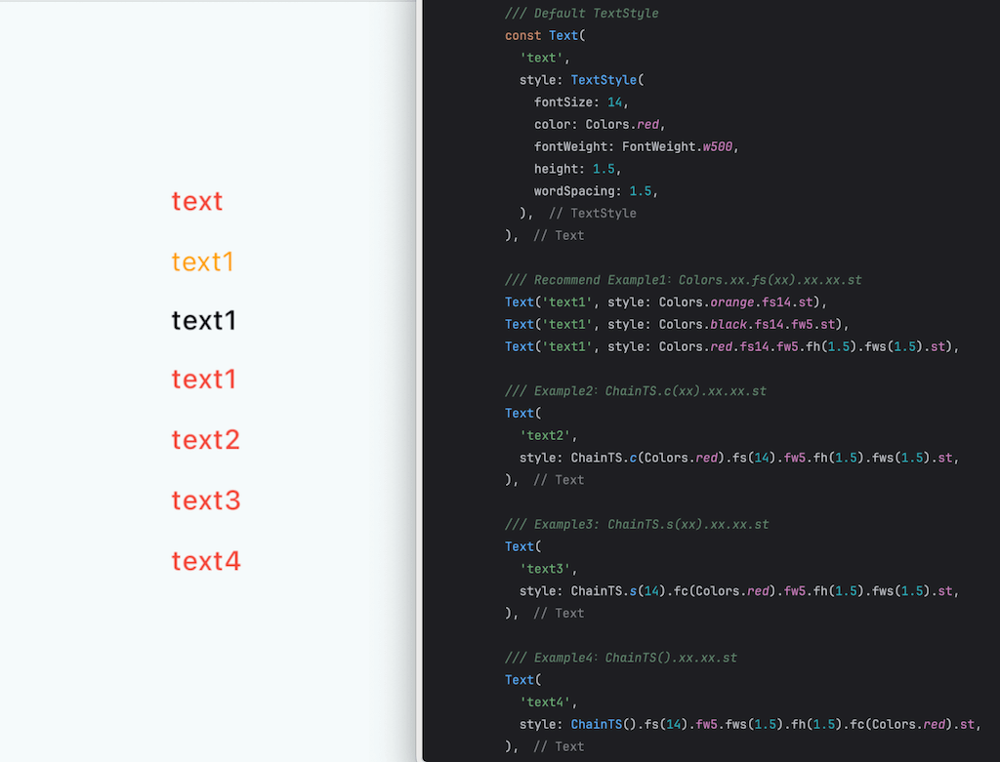

Flutter ChainTextStyle, 

This package provides a simple way to chain methods in Dart.

## Features


## Getting started


## Usage

### Default TextStyle
```dart
Text(
  'text',
  style: TextStyle(
    fontSize: 14,
    color: Colors.red,
    fontWeight: FontWeight.w500,
    height: 1.5,
    wordSpacing: 1.5,
  ),
),
```
---
### Chain TextStyle

Example1：Colors.xx.fs(xx).xx.xx.st 
```dart
Text('text1', style: Colors.orange.fs14.st),

Text('text1', style: Colors.black.fs14.fw5.st),

Text('text1', style: Colors.red.fs14.fw5.fh(1.5).fws(1.5).st),
```

Example2：ChainTS.c(xx).xx.xx.st
```dart
Text(
  'text2',
  style: ChainTS.c(Colors.red).fs(14).fw5.fh(1.5).fws(1.5).st,
),
```

Example3: ChainTS.s(xx).xx.xx.st
```dart
Text(
  'text3',
  style: ChainTS.s(14).fc(Colors.red).fw5.fh(1.5).fws(1.5).st,
),
```

Example4：ChainTS().xx.xx.st
```dart
Text(
  'text4',
  style: ChainTS().fs(14).fw5.fws(1.5).fh(1.5).fc(Colors.red).st,
),
```

